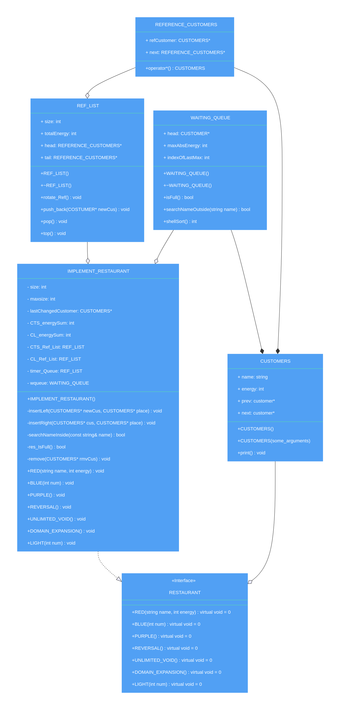

#ASIGNMENT I - DSA DOCUMENT
- [1. Introduction \& Prerequisites](#1-introduction--prerequisites)
- [2. Requirements \& Class Diagram](#2-requirements--class-diagram)
- [3. Flowcharts and short-details of methods](#3-flowcharts-and-short-details-of-methods)
- [4. Unit Test](#4-unit-test)
- [5. UML symbols explanation](#5-uml-symbols-explanation)

## 1. Introduction & Prerequisites ##

In this asignment, we are going to design a C++ core system to handle Booking requirements in a Manga world Restaurant.

Prerequisite:
- Languages: C++ (OOP)
- Data Structures and Algorithm: Doubly Linked List, Queue, Shell Sort. 

## 2. Requirements & Class Diagram ##
We are required to implement some methods that meet up the demand of Restaurant owner's.
There are serveral method which named after some characters in Manga:
- RED()

## 3. Flowcharts and short-details of methods
## 4. Unit Test ##
## 5. UML symbols explanation ##

