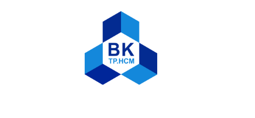
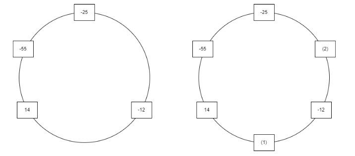

#ASIGNMENT I - DSA DOCUMENT
- [1. Introduction \& Prerequisites](#1-introduction--prerequisites)
- [2. Requirements \& Class Diagram](#2-requirements--class-diagram)
  - [2.1. RED(string name, int energy)](#21-redstring-name-int-energy)
  - [2.2. BLUE(INT NUM)](#22-blueint-num)
  - [2.3. PURPLE()](#23-purple)
  - [2.4. REVERSAL()](#24-reversal)
  - [2.5. UNLIMITED\_VOID()](#25-unlimited_void)
  - [2.6. DOMAIN\_EXPANSION()](#26-domain_expansion)
  - [2.7. LIGHT(INT NUM)](#27-lightint-num)
- [3. Class Diagram](#3-class-diagram)
- [4. Flowcharts and short-details of methods](#4-flowcharts-and-short-details-of-methods)
  - [4.1. RED()](#41-red)
- [5. Unit Test](#5-unit-test)
- [6. Appendix](#6-appendix)

## 1. Introduction & Prerequisites ##

In this asignment, we are going to design a C++ core system to handle Booking requirements in a Manga world Restaurant.

Prerequisite:
- Languages: C++ (OOP)
- Data Structures and Algorithm: Doubly Linked List, Queue, Shell Sort. 

## 2. Requirements & Class Diagram ##
We are required to implement some methods that meet up the demand of Restaurant owner's. There are two kind of customer:
- CTS (Chu-thuat-su): ENERGY > 0
- CL  (Chu-linh): ENERGY < 0
No accept the 0-ENERGY customer.
There are serveral method which named after some characters in Manga(?):
  ### 2.1. RED(string name, int energy) ###
- Responsible for arranging tables in the Restaurant based on customers's information(ENERGY), the first customer came can sit anywhere they want
- When SIZE < MAXSIZE/2:
    - New customer will be arranged next to the last changed position (get out or in) which is called X for short
    - Arranged clockwise in case newCustomer(ENERGY) > X(ENERGY) otherwise
    - Example for X(12) as below
     
- When SIZE >= MAXSIZE/2:
    + Instead of arranging next to X as above, search for another last place (clockwise from X) which has max difference in ENGERGY (RES) - called Y for short 
    + Arranged clockwise in case newCustomer(RES) > 0 otherwise
- The arrangment must guaruatee that there are no two or more Customers in the Restaurent has the same NAME (in the Restaurant means in both Res and in the Waiting Queue)
- When the restaurant is table off, invite the customers to the Waiting Queue. If the Waiting Queue is full too, stop receive Customers
### 2.2. BLUE(INT NUM) ###
- Responsible for sending the customers away since they were in the Restaurant table too long, so that the Restaurent can welcome new customers (who are possibly waiting outside). 
- Send away the NUM customers based on the time order they got into the table from the earliest to the most recent. In case NUM > SIZE, send away all of the customers in the tables.
### 2.3. PURPLE() ###
- Responsible for sorting the Waiting Queue based on the absolute value of ENERGY using Shell Sort Algorithm from the first customer in queue to the first max ENGERGY customer
- After sorting the Waiting Queue, do BLUE(N mod MAXSIZE) with N is the numbers of swap in the previous sort.
### 2.4. REVERSAL() ###
- Responsible for rotate the customers seat in the table, but only rotate the same type of customer (CTS with CTS...) to each other.
### 2.5. UNLIMITED_VOID() ###
- Start from X (the last changed position), go clockwise and find the sub-sequences (with length >= 4) that has the largest sum of ENERGY.
- If found: print out "NAME-ENERGY/n" of every customers ascending order. Otherwide do nothing!
### 2.6. DOMAIN_EXPANSION() ###
- Responsible for sending out all of the customer of one type (CTS or CL) due to the brawl between them (they are enemies of others?)
- If the total CTS(ENERGY) >= CL(ENERGY) then send out all CL and conversely.
- After sending out, welcome the newCustomer and print out "NAME-ENERGY/n" of every customers which got out of Restaurant in time - ascending order (from the soonest to the most recent)
### 2.7. LIGHT(INT NUM) ###
- Print out "NAME-ENERGY/n" of all customers in the table in clockwise direction if NUM>0 and conversely.
  
## 3. Class Diagram ##
After analysing the requirements, one of the possible designs can be as below. 
(Check the Appendix for explanation for these symbols in case you are not familiar with them).
.png)
## 4. Flowcharts and short-details of methods
### 4.1. RED() ###
## 5. Unit Test ##
## 6. Appendix ##

